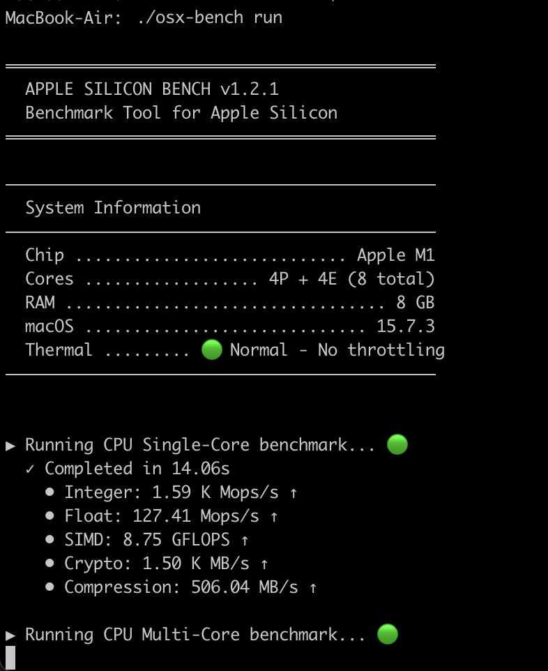
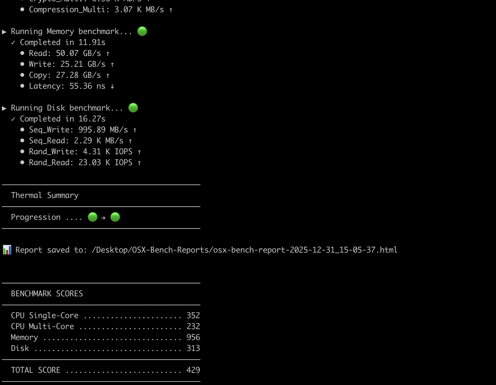

# Apple Silicon Bench

**A native macOS benchmark tool for Apple Silicon Macs (M1, M2, M3, M4, M5)**

[](https://github.com/carlosacchi/apple-silicon-bench/releases)
[](https://opensource.org/licenses/MIT)
[](https://www.apple.com/macos/)
[](https://swift.org/)

A lightweight, native Swift benchmark tool designed specifically for Apple Silicon processors. Compare your M1, M2, M3, M4, M5 (and future chips) performance with comprehensive CPU, GPU, memory, and disk benchmarks.

## Features

- **CPU Single-Core Benchmark**: Integer, floating-point, SIMD (Accelerate framework), cryptography (AES-GCM), and compression tests
- **CPU Multi-Core Benchmark**: Parallel workload scaling across all P-cores and E-cores
- **GPU Benchmark (Metal)**: Compute shaders, particle simulation, image processing (blur, edge detection)
- **Memory Benchmark**: Sequential read/write bandwidth, memory copy speed, and random access latency
- **Disk Benchmark**: Sequential and random I/O performance with cache bypass
- **Thermal Monitoring**: Real-time thermal state tracking during benchmarks
- **Beautiful HTML Reports**: Interactive charts and detailed breakdowns saved to Desktop
- **Lightweight Binary**: ~2MB standalone executable, no dependencies required

## Screenshots

### Running Benchmark


### Results Output


## Quick Start

### Download Binary

Download the latest release from the [Releases page](https://github.com/carlosacchi/apple-silicon-bench/releases).

```bash
# Download and extract
curl -LO https://github.com/carlosacchi/apple-silicon-bench/releases/latest/download/osx-bench-macos-arm64.tar.gz
tar -xzf osx-bench-macos-arm64.tar.gz

# Remove macOS quarantine and make executable
xattr -cr osx-bench
chmod +x osx-bench

# Run benchmark
./osx-bench run
```

### Build from Source

Requires Xcode 15+ or Swift 5.9+ toolchain.

```bash
git clone https://github.com/carlosacchi/apple-silicon-bench.git
cd apple-silicon-bench
swift build -c release
./.build/release/osx-bench run
```

## Usage

### Full Benchmark Suite

```bash
# Run all benchmarks (default: 10 seconds per test category)
osx-bench run

# Quick mode - faster but less accurate (~3s per test)
osx-bench run --quick

# Custom duration - specify seconds per test category
osx-bench run --duration 30

# Stress test mode - extended duration (~60s per test)
osx-bench run --stress
```

### Selective Benchmarks

```bash
# CPU only
osx-bench run --only cpu-single,cpu-multi

# GPU only (Metal compute)
osx-bench run --only gpu

# Memory and disk only
osx-bench run --only memory,disk

# All except GPU
osx-bench run --only cpu-single,cpu-multi,memory,disk
```

### System Information

```bash
# View system info
osx-bench info

# Detailed system info
osx-bench info --detailed
```

### Test Duration Options

```bash
# Default run: 10 seconds per test category (recommended)
osx-bench run

# Quick mode: ~3 seconds per test (faster, less accurate)
osx-bench run --quick

# Custom duration: specify exact seconds (e.g., 30 seconds per test)
osx-bench run -d 30
osx-bench run --duration 30

# Stress mode: ~60 seconds per test (thorough, detects thermal throttling)
osx-bench run --stress

# Combine with selective benchmarks
osx-bench run --only cpu-single --duration 60
```

### Export Results

```bash
# Export to JSON
osx-bench run --export results.json
```

## Benchmark Categories

### CPU Single-Core

| Test | Description | Metric |
|------|-------------|--------|
| Integer | 64-bit integer arithmetic operations | ops/sec |
| Float | Double-precision floating-point | GFLOPS |
| SIMD | Accelerate framework vDSP operations | GFLOPS |
| Crypto | AES-256-GCM encryption | GB/s |
| Compression | LZFSE compress/decompress | MB/s |

### CPU Multi-Core

Same tests as single-core, executed in parallel across all CPU cores with efficiency scaling measurement.

### Memory

| Test | Description | Metric |
|------|-------------|--------|
| Read | Sequential memory read bandwidth | GB/s |
| Write | Sequential memory write bandwidth | GB/s |
| Copy | Memory copy (memcpy) performance | GB/s |
| Latency | Random access latency (pointer chase) | ns |

### Disk

| Test | Description | Metric |
|------|-------------|--------|
| Seq Read | Sequential file read | MB/s |
| Seq Write | Sequential file write | MB/s |
| Rand Read | 4KB random read IOPS | IOPS |
| Rand Write | 4KB random write IOPS | IOPS |

### GPU (Metal)

Native Metal compute benchmarks for Apple Silicon integrated GPUs.

| Test | Description | Metric |
|------|-------------|--------|
| Compute | Matrix multiplication (2048x2048) | GFLOPS |
| Particles | Particle physics simulation (1M particles) | Mparts/s |
| Blur | Gaussian blur 5x5 kernel (4096x4096) | MP/s |
| Edge | Sobel edge detection (4096x4096) | MP/s |

**Technical details:**
- Metal shaders compiled at runtime (no external dependencies)
- Synthetic test images generated procedurally
- Quick mode uses reduced sizes (1024 matrix, 100K particles, 2048 images)

## Thermal Monitoring

The benchmark tracks macOS thermal state throughout the run:

- 🟢 **Nominal**: Normal operation, no throttling
- 🟡 **Fair**: Slightly warm, minor throttling possible
- 🟠 **Serious**: Hot, significant throttling active
- 🔴 **Critical**: Maximum throttling, severely impacted

If throttling is detected, results may be lower than optimal. Consider waiting for the system to cool down.

## HTML Report

After each benchmark run, a detailed HTML report is generated at:

```
~/Desktop/OSX-Bench-Reports/osx-bench-report-YYYY-MM-DD_HH-mm-ss.html
```

The report includes:
- System information (chip, cores, RAM, macOS version)
- Score breakdown with interactive charts
- Thermal progression timeline
- Detailed results for each benchmark category

View an [example HTML report](Sources/assets/osx-bench-report-2025-12-31_15-05-37.html) to see the output format.

## Scoring System

Scores are normalized against a baseline (M1 base chip = 1000 points per category):

- **CPU Single-Core**: 25% of total score
- **CPU Multi-Core**: 25% of total score
- **Memory**: 15% of total score
- **Disk**: 15% of total score
- **GPU**: 20% of total score

Higher scores indicate better performance. An M1 chip scores approximately 1000 in each category.

## Supported Systems

- **macOS**: 13.0 (Ventura) or later
- **Architecture**: Apple Silicon only (M1, M2, M3, M4, M5 family)
- **Processor Types**: MacBook Air, MacBook Pro, Mac mini, Mac Studio, Mac Pro, iMac

## Comparison Examples

Use this tool to compare different Apple Silicon configurations:

- M1 vs M1 Pro vs M1 Max vs M1 Ultra
- M2 vs M3 vs M4 vs M5
- Base vs Pro vs Max variants
- Different RAM configurations
- MacBook vs Mac Studio thermal performance

## Contributing

Contributions are welcome! Please feel free to submit a Pull Request.

1. Fork the repository
2. Create your feature branch (`git checkout -b feature/amazing-feature`)
3. Commit your changes (`git commit -m 'Add amazing feature'`)
4. Push to the branch (`git push origin feature/amazing-feature`)
5. Open a Pull Request

## License

This project is licensed under the MIT License - see the [LICENSE](LICENSE) file for details.

## Comparison with Other Benchmark Tools

| Feature | Apple Silicon Bench | Geekbench 6 | Cinebench 2024 | Blackmagic Disk Speed |
|---------|---------------------|-------------|----------------|----------------------|
| **Open Source** | Yes | No | No | No |
| **Offline/Local** | Yes | Requires account | Yes | Yes |
| **Transparent Scoring** | Yes, documented methodology | Closed algorithm | Closed algorithm | N/A (raw speeds) |
| **macOS Native** | Swift + Accelerate | Cross-platform | Cross-platform | macOS native |
| **Thermal Monitoring** | Yes, real-time | No | No | No |
| **CPU Benchmark** | Yes | Yes | Yes | No |
| **GPU Benchmark** | Planned (v1.3) | Yes | Yes (GPU variant) | No |
| **Memory Benchmark** | Yes | Yes | No | No |
| **Disk Benchmark** | Yes (cache bypass) | No | No | Yes |
| **AI/ML Benchmark** | Planned (v1.4) | Yes (ML) | No | No |
| **Power Monitoring** | Planned (v1.5) | No | No | No |
| **Media Engine** | Planned (v1.6) | No | No | Yes (ProRes) |
| **Real-World Workloads** | Planned (v1.7) | Synthetic only | Rendering only | I/O only |
| **Price** | Free | $15 (Pro) | Free | Free |
| **Binary Size** | ~2MB | ~200MB | ~1GB | ~10MB |

### Why Apple Silicon Bench?

1. **Transparency**: Know exactly what's being measured. Geekbench's "single-core score" is a black box.
2. **No Cloud Required**: Your benchmarks stay on your machine. No accounts, no uploads.
3. **Thermal Awareness**: See if your score dropped due to throttling, not slow hardware.
4. **Focused**: Built specifically for Apple Silicon, not ported from x86.
5. **Extensible**: Open source means you can add benchmarks relevant to your workflow.
6. **Lightweight**: A 2MB binary vs gigabytes of downloads.

### When to Use Other Tools

- **Geekbench**: When you need cross-platform comparisons (Mac vs PC vs Phone)
- **Cinebench**: When you specifically care about 3D rendering performance
- **Blackmagic**: When you need ProRes-specific disk speed validation for video workflows

## Roadmap

### v1.2 - Extended System Info ✅
- [x] Disk info (model, capacity, SSD/HDD type)
- [x] `osx-bench info --brief` vs `--extended` vs `--sensitive` modes
- [x] GPU info (chip, core count, Metal version)
- [x] Battery info for MacBooks (cycle count, health, charging status)

### v1.3 - GPU Benchmark (Metal) ✅
- [x] Metal compute shaders benchmark (matrix multiplication)
- [x] Image processing tests (Gaussian blur, Sobel edge detection)
- [x] Particle physics simulation
- [ ] Stereo matching / depth estimation (future)
- [ ] Unified Memory bandwidth (CPU-GPU transfer) (future)

### v1.4 - AI & Machine Learning
- [ ] Neural Engine benchmark (CoreML inference with bundled MobileNet ~500KB)
- [ ] BNNS (Basic Neural Network Subroutines) operations
- [ ] Image classification speed test

### v1.5 - Power & Efficiency
- [ ] Real-time power consumption monitoring (Watts)
- [ ] Power efficiency score (GFLOPS per Watt)
- [ ] Battery drain test for MacBooks
- [ ] Enhanced thermal throttling analysis

### v1.6 - Media Engine
- [ ] ProRes encode/decode benchmark (VideoToolbox)
- [ ] HEVC/H.264 hardware encoding speed (VideoToolbox)
- [ ] Hardware decoder throughput test

### v1.7 - Real-World Workloads
- [ ] Swift project compile-time benchmark (requires Xcode on system)
- [ ] Archive compression (Compression.framework: LZMA, LZ4, ZLIB)
- [ ] JavaScriptCore parsing and execution benchmark
- [ ] Mixed workload simulation (concurrent disk+memory+CPU operations)

### v1.8 - Advanced Memory
- [ ] Cache latency tests (L1, L2, L3 separately)
- [ ] Memory bandwidth per core type (P-core vs E-core)
- [ ] NUMA-aware memory access patterns

### Future
- [ ] Online leaderboard for community comparisons
- [ ] Historical tracking of machine performance over time
- [ ] USB/Thunderbolt bandwidth testing
- [ ] Geekbench-compatible export format

## Design Decisions

### Why We Chose Native Frameworks Over External Dependencies

A core principle of Apple Silicon Bench is staying **lightweight** (~2-5MB binary) while providing comprehensive benchmarks. This means we prefer macOS built-in frameworks over external dependencies.

| Feature Request | Our Approach | Why Not the Alternative? |
|-----------------|--------------|--------------------------|
| **AI/ML Benchmark** | CoreML + BNNS | ❌ MLX requires Python/C++ runtime (~100MB+). BNNS is Apple's neural network primitives, built into macOS. |
| **Video Transcoding** | VideoToolbox | ❌ FFmpeg adds ~80MB binary. VideoToolbox accesses the same hardware encoders (ProRes, HEVC, H.264) natively. |
| **JavaScript Benchmark** | JavaScriptCore | ❌ V8/SpiderMonkey would add ~20MB+. JSC is Safari's engine, built into macOS. |
| **Compile Benchmark** | Swift only | ❌ Rust toolchain is ~500MB. Swift/Xcode is commonly installed on dev Macs. |

### What We Won't Add (and Why)

| Feature | Reason |
|---------|--------|
| **MLX Framework Tests** | Requires separate Python environment, not self-contained |
| **Rust/Go/C++ Compile Tests** | Would require users to install additional toolchains |
| **FFmpeg Transcoding** | 80MB dependency for something VideoToolbox does natively |
| **Chrome/V8 JavaScript** | Massive dependency; JavaScriptCore provides equivalent browser-style workload |
| **CUDA/OpenCL Tests** | Not relevant for Apple Silicon (Metal is the native GPU API) |

### Trade-offs We Accept

1. **CoreML Model Size**: We bundle a small MobileNet model (~500KB) for Neural Engine benchmarks. This slightly increases binary size but enables ANE testing without network downloads.

2. **Xcode Requirement for Compile Benchmark**: The Swift compile benchmark requires Xcode to be installed. We detect this at runtime and skip gracefully if unavailable.

3. **Power Monitoring Limitations**: Real power consumption requires IOKit entitlements that may not work on all Mac configurations. We provide best-effort monitoring with clear disclaimers.

### Community-Requested Features Under Consideration

Have a benchmark idea? [Open an issue](https://github.com/carlosacchi/apple-silicon-bench/issues) with:
- What you want to measure
- Why it's useful for Apple Silicon users
- Suggested implementation approach (ideally using macOS native frameworks)

## Keywords

Apple Silicon benchmark, M1 benchmark, M2 benchmark, M3 benchmark, M4 benchmark, M5 benchmark, macOS performance test, Mac benchmark tool, Apple Silicon performance, M1 Pro benchmark, M1 Max benchmark, M2 Pro benchmark, M3 Pro benchmark, M4 Pro benchmark, M5 Pro benchmark, Mac CPU benchmark, Mac memory benchmark, Mac SSD benchmark, Apple chip comparison, ARM Mac benchmark, native macOS benchmark

## Author

**Carlo Sacchi**

- GitHub: [@carlosacchi](https://github.com/carlosacchi)

---

Made with Swift for Apple Silicon by Carlo Sacchi
